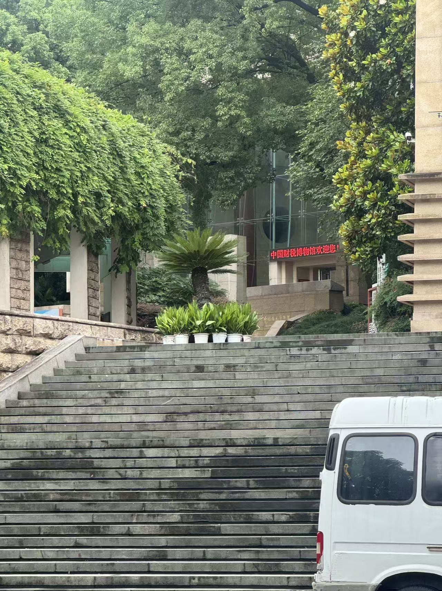
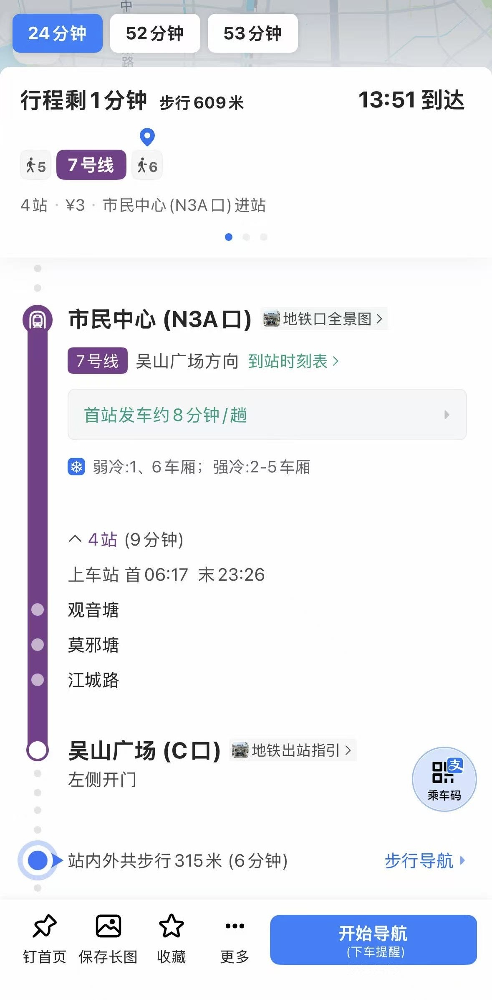

# 中国财税博物馆参观指南

## 一、博物馆基本信息

| 项目 | 内容 |
|------|------|
| 名称 | 中国财税博物馆 |
| 地址 | 浙江省杭州市上城区吴山广场南侧（吴山脚下） |
| 预约电话 | 0571-87835356（需提前1天预约） |
| 开放时间 | 9:00 - 16:30（16:00停止入场） |
| 闭馆日 | 每周一（国定假日除外） |
| 门票 | 免费（凭有效证件免费入场） |
| 参观时长 | 约1小时 |
| 主管单位 | 财政部、国家税务总局 |
| 建筑面积 | 12,000 平方米，占地 27 亩 |
| 馆藏数量 | 各类财税历史文物及文献资料近万件 |

---

## 二、交通路线

### 🚗 自驾
- 停车场：**吴山广场C区停车场**
- 停好车后沿台阶步行上山，即可到达博物馆入口
- 建议提前查询实时停车位，节假日周边停车位较紧张

### 🚇 地铁
- **地铁7号线** → 在 **吴山广场站（C口）** 出站
- 出站后步行约 **6分钟（315米）** 到达博物馆
- 班次间隔约8分钟，票价¥3

---

## 三、建筑特色

中国财税博物馆建筑本身极具象征意义，是参观时值得介绍的亮点：

- **平面布局**：采用战国时期大型"**耸肩空首布**"的形状设计，空首布是中国最早的金属铸币之一，以此寓意国家财政之根基。
- **内部细节**：大量运用**方形与圆形**的组合，象征秦代货币"**半两方孔圆钱**"——外圆内方，寓意钱币与财政秩序。
- **选址意义**：位于吴山脚下、西湖之畔、钱江之滨，依托杭州深厚的历史文化底蕴，与周边吴山庙会、城隍阁等历史遗存相辅相成。

---

## 四、参观路线安排

> **官方推荐路线：从2楼出发 → 负1楼结束（古代 → 近现代 → 当代）**

### 总览：展厅分布

| 楼层 | 展厅名称 | 主题 |
|------|---------|------|
| 2楼 | 财富中国展厅 | 序厅·总览 |
| 2楼 | 中国古代财税历史展厅 | 上古至清末 |
| 1楼 | 摇钱树与理财家展区 | 特色专题 |
| 1楼 | 中国会计历史展厅 | 账簿与核算文化 |
| -1楼 | 中国近现代财税历史展厅 | 1840—1949年 |
| -1楼 | 中国当代财税历史展厅 | 1949年至今 |

---

## 五、周边延伸游览

参观完博物馆后，可就近游览：

| 景点 | 距离 | 特色 |
|------|------|------|
| 吴山广场 | 步行2分钟 | 俯瞰杭州城区，西湖远景 |
| 城隍阁 | 步行5分钟 | 仿古楼阁，登高远眺 |
| 河坊街 | 步行10分钟 | 明清风格历史街区，小吃特产 |
| 清河坊历史街区 | 步行10分钟 | 传统商业文化 |
| 西湖 | 步行/骑行15分钟 | 杭州标志性景区 |

---

## 六、博物馆背景知识

### 为什么要建中国财税博物馆？
税收是国家运转的经济基础，也是文明进步的重要标志。中国有5000年的财税历史，是世界上税制最为完备、演变最为丰富的国家之一。中国财税博物馆旨在通过实物、文献、场景再现等方式，系统展现中国财税制度的历史脉络，弘扬依法纳税、诚信纳税的文化理念。

### 一句话串联中国税制历史
> **上古：贡品与劳役 → 秦汉：钱粮并征 → 隋唐：租庸调→两税法 → 明：一条鞭法（货币化）→ 清：摊丁入亩（废人头税）→ 近代：被动改革 → 当代：现代税制体系**

### 税收与国家治理的关系
- 税收轻重直接影响朝代兴衰（汉初轻税→文景之治；明末加税→农民起义）
- 税制改革往往伴随社会变革（张居正改革→一条鞭法→明代商品经济繁荣）
- 现代国家的税收更是公共服务的资金来源，体现"取之于民、用之于民"的原则

